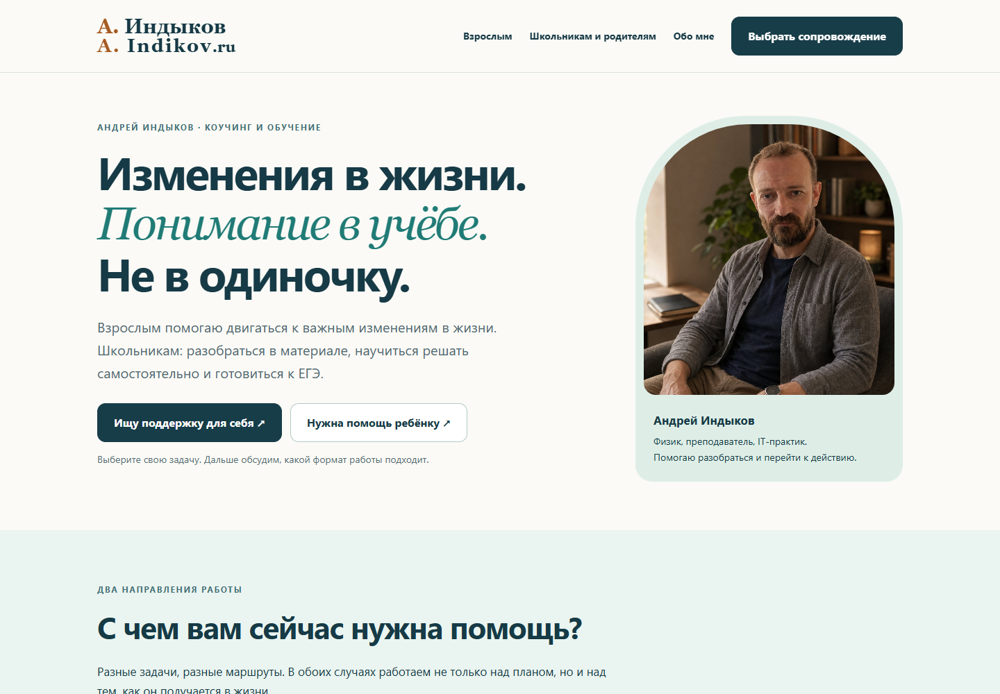
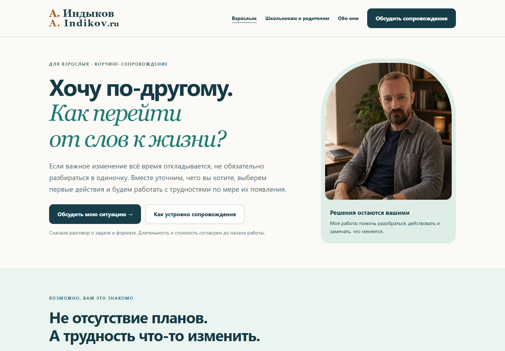
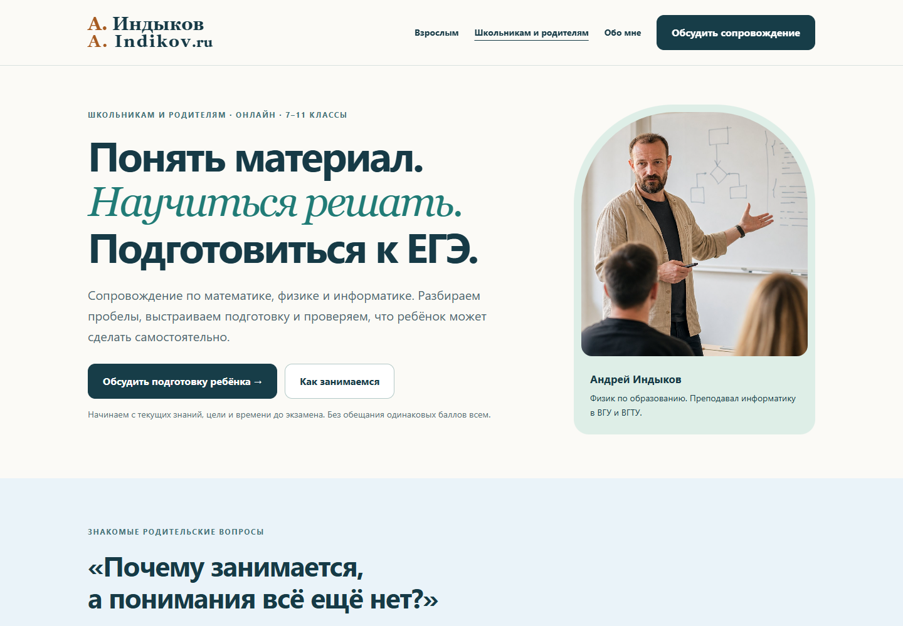

# Андрей Индыков: сопровождение взрослых и школьников

Сайт [indikov.ru](https://indikov.ru/) о работе с Андреем Индыковым. Два направления, две разные задачи.

**Взрослым:** разобраться, что хочется изменить в жизни, перейти к действиям и не остаться один на один с трудностями по пути.

**Школьникам и родителям:** понять материал, научиться решать самостоятельно и подготовиться к ЕГЭ по математике, физике или информатике.

Основной формат работы: сопровождение. На встречах разбираемся и выбираем следующие шаги. Между встречами человек пробует их в жизни или в учёбе. Затем проверяем, что получилось, и корректируем план.

## Основные страницы

| Страница | Для чего |
| --- | --- |
| [Главная](https://indikov.ru/) | Выбрать направление: помощь себе или ребёнку |
| [Сопровождение взрослых](https://indikov.ru/coaching/) | Узнать, как устроена работа над изменениями в жизни, и обсудить свою ситуацию |
| [Учёба и подготовка к ЕГЭ](https://indikov.ru/repetitor/) | Посмотреть подход к занятиям и описать трудности ребёнка |
| [Статьи](https://indikov.ru/articles/) | Познакомиться с подходом через тексты и упражнения |

На страницах сопровождения можно подготовить сообщение для Андрея. Форма не отправляет заявку в базу: она собирает текст в браузере, после чего посетитель сам решает, отправлять ли его в Telegram. Телефон и электронная почта не требуются.

Длительность, частота встреч и стоимость согласуются до начала работы. Коучинг не заменяет психотерапию. Конкретный балл на экзамене не гарантируется.

## Как выглядит сайт

Ниже настоящие скриншоты браузера, не дизайн-макеты. Сняты с локального просмотра файлов репозитория 28 сентября 2026 года. Они показывают сохранённую версию сайта, но не подтверждают доступность домена в конкретной сети.

### Главная: выбрать свою задачу

[Вся страница](docs/screenshots/home-desktop-full.png) · [На телефоне](docs/screenshots/home-mobile.png) · [Вся мобильная страница](docs/screenshots/home-mobile-full.png)

### Взрослым: изменения в жизни

[Вся страница](docs/screenshots/adults-desktop-full.png) · [На телефоне](docs/screenshots/adults-mobile.png) · [Вся мобильная страница](docs/screenshots/adults-mobile-full.png)

### Школьникам и родителям: понимание и подготовка к ЕГЭ

[Вся страница](docs/screenshots/students-desktop-full.png) · [На телефоне](docs/screenshots/students-mobile.png) · [Вся мобильная страница](docs/screenshots/students-mobile-full.png)

## Бесплатные материалы и инструменты

Их можно использовать самостоятельно. Проходить тесты или покупать мини-курс перед обращением за сопровождением не нужно.

| Материал | Что внутри |
| --- | --- |
| [Первый шаг к изменению](https://indikov.ru/coaching/#first-step) | Три вопроса для формулировки своей задачи |
| [Карта недели](https://indikov.ru/coaching/week-map.html) | Девять вопросов о нагрузке, восстановлении и повседневных делах |
| [Карта подготовки ученика](https://indikov.ru/repetitor/diagnostics.html) | Самооценка организации подготовки, не проверка предметных знаний |
| [Тест ученику](https://indikov.ru/repetitor/student-test.html) | Сохранённый интерактивный материал для самостоятельного знакомства |
| [Геометрия](https://indikov.ru/repetitor/materials/geometry/) | Пять учебных страниц для повторения и печати |
| [Учебные промпты](https://indikov.ru/repetitor/prompts.html) | Как использовать ИИ для подсказок и проверки своей работы |
| [Типологии и инструменты](https://indikov.ru/typolog/) | Дополнительные способы исследования себя |
| [НейроТипировщик](https://indikov.ru/sociotyper/) | Экспериментальный инструмент, не научная или медицинская диагностика |

Прежние страницы и материалы сохранены. Раздел `/neurocoaching/` доступен по прямой ссылке и не включён в основную навигацию. Отдельные проекты: [программа с Юлей](https://indikov.ru/pereSBorka.html) и [страница Милы](https://indikov.ru/mila.html). Старые адреса `/school/` и `/shcool/` ведут в раздел `/repetitor/`.

## Где менять сайт

| Что меняем | Файл |
| --- | --- |
| Главная | `index.html` |
| Страница для взрослых | `coaching/index.html` |
| Страница для родителей и школьников | `repetitor/index.html` |
| Оформление трёх основных страниц | `assets/accompany.css` |
| Мобильное меню и подготовка сообщения | `assets/accompany.js` |
| Карта недели | `coaching/week-map.html`, `assets/sales.js` |
| Навигация статей | `_includes/site-nav.html` |
| Шаблон статьи и переход к сопровождению | `_layouts/post.html` |
| Скриншоты | `docs/screenshots/` |

Статьи находятся в `_posts/`. Инструкция: [как добавить статью](ADD_ARTICLE.md).

## Публикация и проверка

Сайт размещён на GitHub Pages из этого репозитория. Обновления публикуются после изменений в ветке `main`. Результат сборки виден во вкладке [Actions](https://github.com/andrjur/mimom/actions). Домен задан в файле `CNAME`. Статьи собираются через Jekyll.

Старый архив `mimom-redesign-v4.zip` не является актуальным источником сайта. Для работы используйте текущие файлы репозитория.

Перед публикацией:

- Проверьте компьютерную и мобильную версии, меню, изображения и переходы.
- Убедитесь, что форма готовит сообщение и не выдаёт его за отправленную заявку.
- Не публикуйте ключи, токены, переписки и данные клиентов.
- Не удаляйте старые адреса без перенаправлений.
- После успешной сборки отдельно проверьте домен. Зелёная сборка не исключает проблем сети, DNS или сертификата.

Для локального просмотра из корня репозитория можно запустить `python -m http.server 8768` и открыть `http://localhost:8768/`. Основные HTML-страницы работают без сборки; Markdown-статьям требуется Jekyll.
